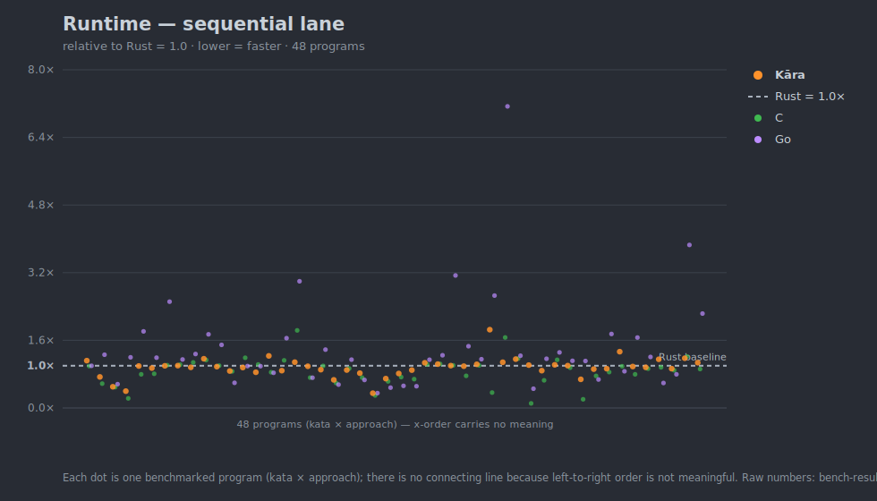
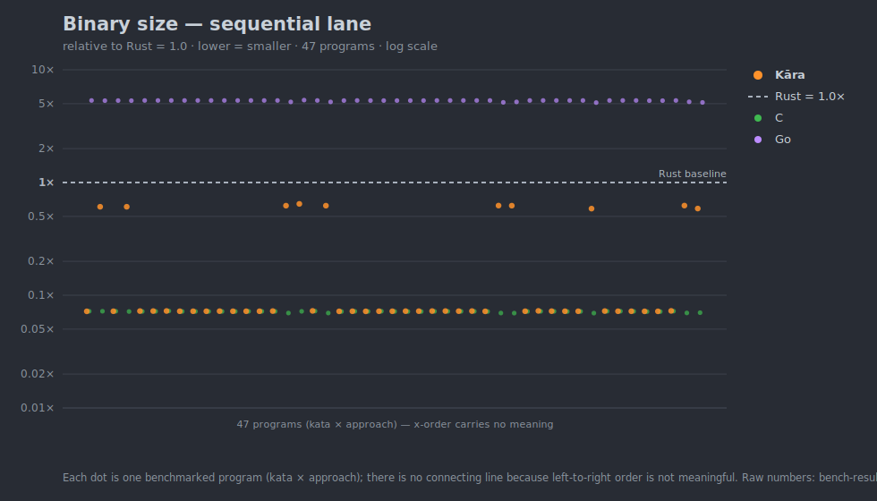
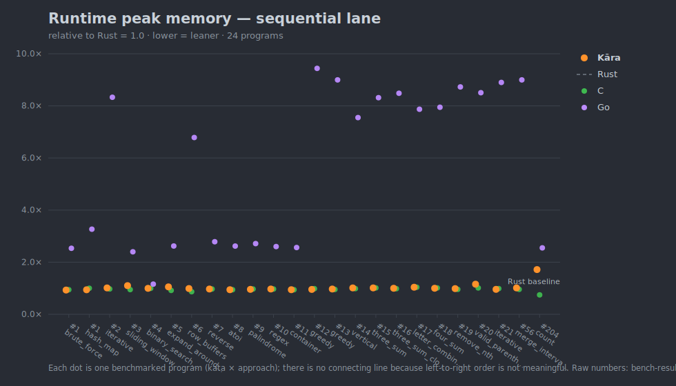
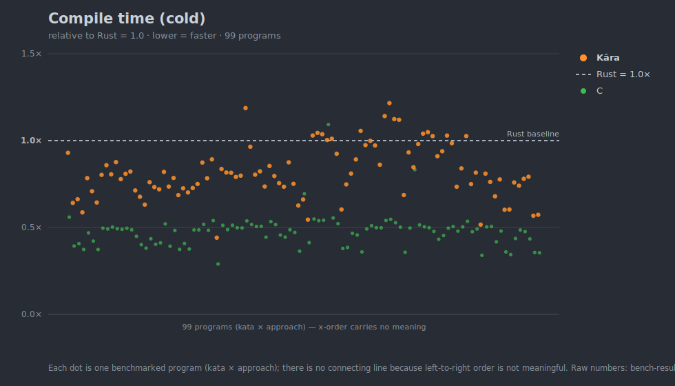
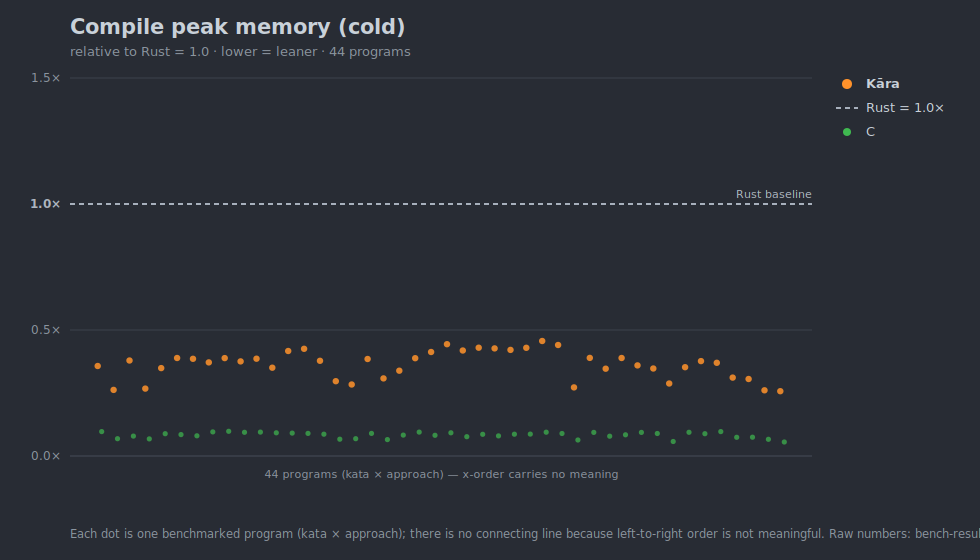
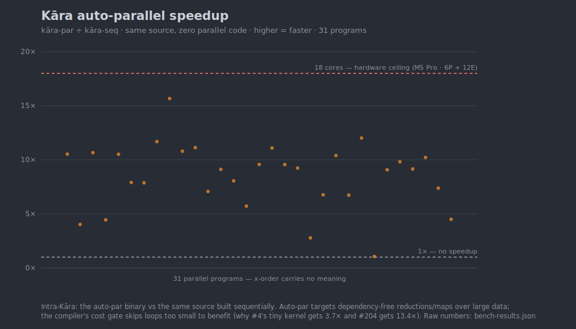
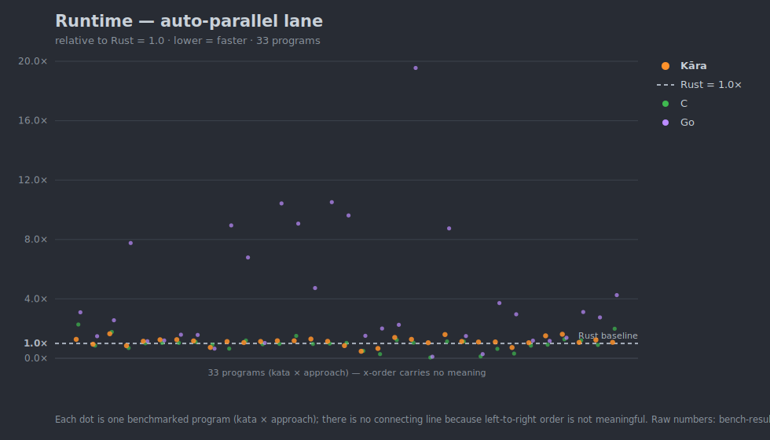

# Benchmarks

The full chart set, redrawn from [`bench-results.json`](bench-results.json) by
[`scripts/bench-graph.py`](scripts/bench-graph.py). Start at the
[README](README.md) for the short version; this page is the complete picture.

**How to read every chart below:** each dot is one benchmarked *program* (a
kata × algorithm-approach). Every value is relative to **Rust = 1.0** (the flat
baseline line); **lower is always better** (faster / smaller / leaner). Kāra is
the orange dots. The dots are deliberately *not* connected — left-to-right order
carries no meaning, so these read as distributions across the suite, not as
trends or time series. (As the corpus grows the dots pile into a density band per
language — that band, and where Kāra's sits relative to the baseline, is the
whole story.) Raw absolute numbers are in the feed.

Languages: **Kāra** (`karac build`), **Rust** (`rustc -O`), **C** (`clang -O3`),
**Go** (`go build`). Python is excluded from these charts — at 10–70× the
compiled languages it would flatten everything; its numbers are in the per-kata
READMEs and the JSON feed.

## Runtime — sequential lane

Single-threaded, same algorithm everywhere. This is the load-bearing
per-core compiler-quality comparison.

Kāra's cloud tracks C's closely and straddles the Rust baseline depending on the
workload — ahead on allocation/RC- and string-heavy kernels, behind on a few
tight numeric loops. Go trails on most single-threaded work.

## Binary size — sequential lane

Stripped native binary, on disk. Log scale, because Go is ~70× the others.

Kāra emits C-sized binaries (~33 KiB) for most programs and rises to its
~285 KiB compute floor when it links the larger runtime surface (hash maps,
strings). Rust sits ~14× above C; Go ~70× above, carrying its runtime + GC in
every binary.

## Runtime peak memory — sequential lane

Peak RSS during execution.

Kāra, C, and Rust cluster at parity (~1.0×) — Kāra runs leak-free at native
footprint. Go's GC heap pushes it to 2–8× depending on allocation pressure.

## Compile time — cold

Wall-clock for a full cold compile of one file (artifact deleted first). Go is
omitted: `go build` bundles module resolution + multi-package compile + link,
which isn't comparable to a single-file compiler invocation.

Kāra's compiler is faster than `rustc -O` on every program here (~0.55–0.8×),
sitting between clang (the LLVM single-file floor) and rustc.

## Compile peak memory — cold

Peak RSS of the compiler process. Go omitted for the same reason as above.

Kāra compiles in ~0.3× of rustc's peak memory — again between clang and rustc,
with no algorithmic blowup.

## Auto-parallel speedup (Kāra)

Kāra's compiler automatically parallelizes dependency-free reductions and maps —
no `rayon`, no goroutines, no thread plumbing, and no data-race risk, because the
transform belongs to the compiler, not to you. This chart is *intra-Kāra*: the
auto-par binary against the **exact same source** compiled sequentially.

This is the one place Kāra does something mainstream languages don't hand you for
free — which also makes it the easiest chart to over-read, so read it carefully:

- **It applies to data-parallel reductions/maps over large datasets** — `Σ f(xᵢ)`
  over millions of independent inputs, the shape behind analytics rollups,
  numeric kernels, simulation, per-record/per-pixel work. It does **nothing** for
  I/O-bound, tiny, or sequentially-dependent loops, and the compiler's **cost gate
  declines** to parallelize loops too small to pay off. That's exactly why #4's
  ~hundred-nanosecond kernel earns only 3.7× while #204's heavier kernel reaches
  13.4×, against an 18-core ceiling.
- **The speedup is workload- and core-bound physics, not a universal multiplier**
  on your program. The honest claim is *ergonomic, safe, automatic parallelization
  where it applies* — these numbers are evidence it scales, not a promise about
  arbitrary code.
- **This is a real distribution now (26 programs), not a teaser.** Every kata
  whose `karac build` engages auto-par contributes a point; the spread from the
  cost-gate floor up to ~13× against the 18-core ceiling is the spectrum, not a
  single illustrative number.

### Cross-language parallel lane

The *other* parallel comparison — Kāra auto-par (zero parallel source) vs Rust
`rayon` vs Go goroutines vs a C-pthreads metal floor on the same workload — is
the headline chart in the **[README](README.md#parallel-lane--auto-par-vs-hand-tuned)**:

Five katas currently ship the full parallel comparator set (#1 two-sum, #204
count-primes, #394 decode-string, #722 remove-comments, #125 valid-palindrome).
Across them Kāra's auto-par lands in the same range as hand-tuned `rayon` —
ahead on two, behind on three, by at most 1.35× — for none of the engineering
cost. Katas whose per-call work is too small for rayon/goroutine dispatch to win
(parallelizing them by hand would *lose* to sequential) contribute only the
intra-language auto-par speedup above and stay seq-only here. More points land
automatically as parallel katas are added.

## Caveats

The same honesty notes from the [README](README.md#what-these-numbers-are--and-arent)
apply: these are single-file algorithm kernels, not applications; wall-times are
noise-limited (shared M5 Pro), while size and memory are stable. Read the shape,
not the last digit, and consult [`bench-results.json`](bench-results.json) for
the underlying numbers.
