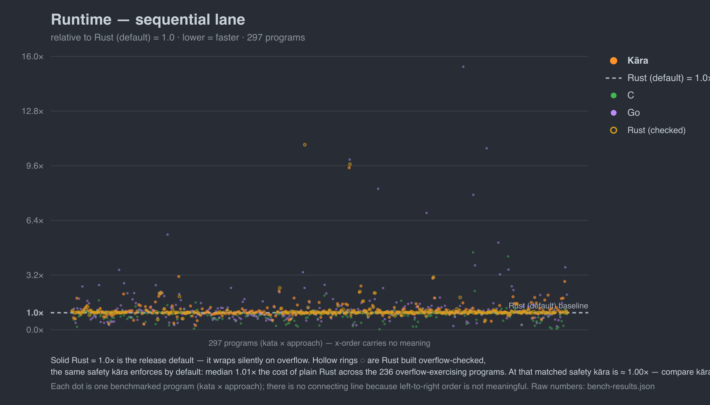
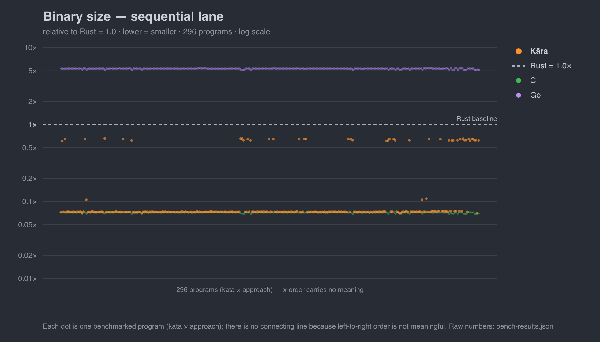
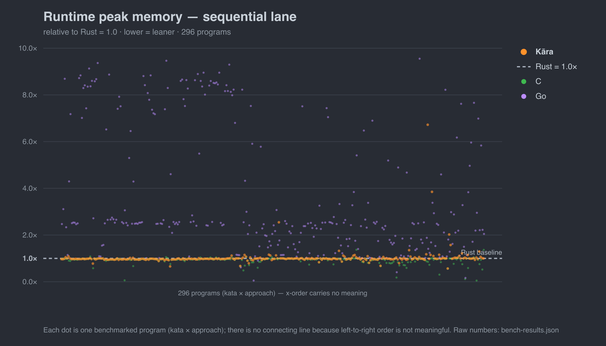
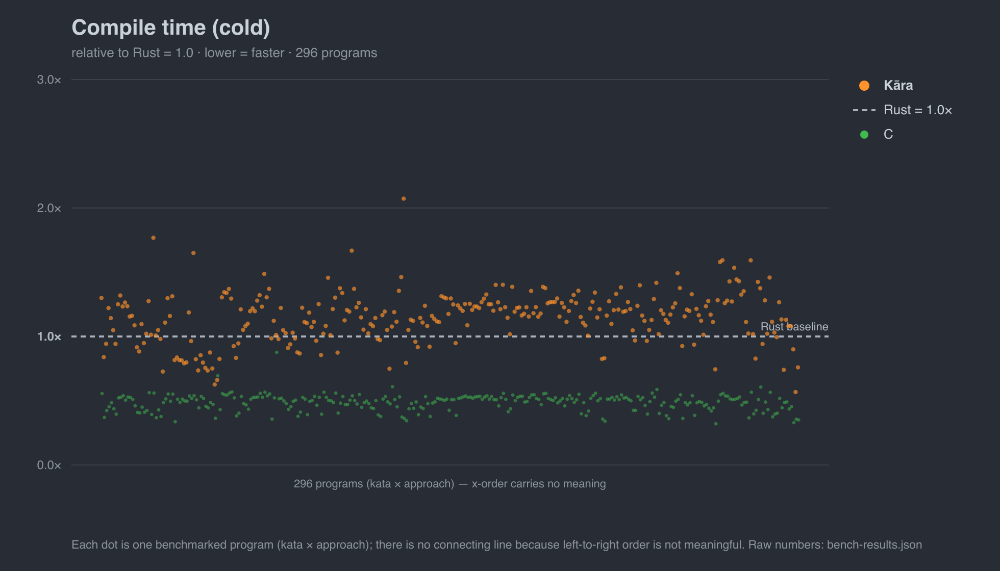
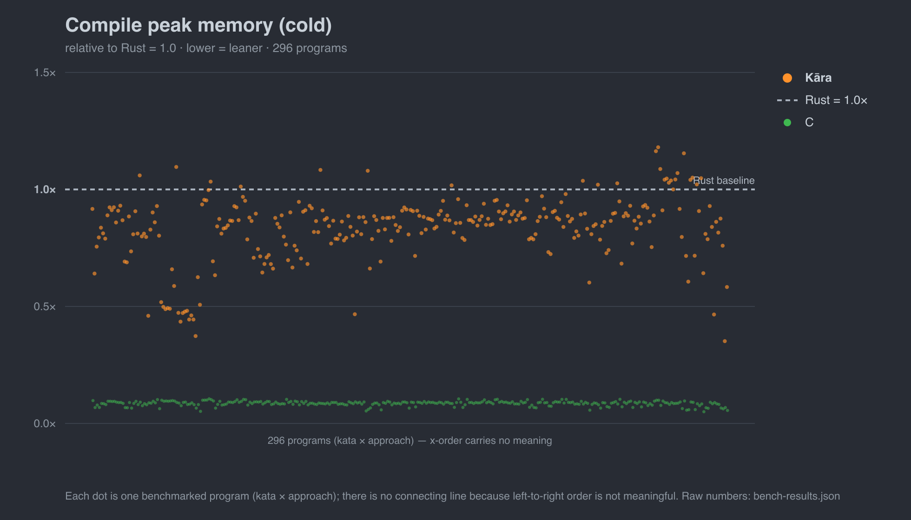
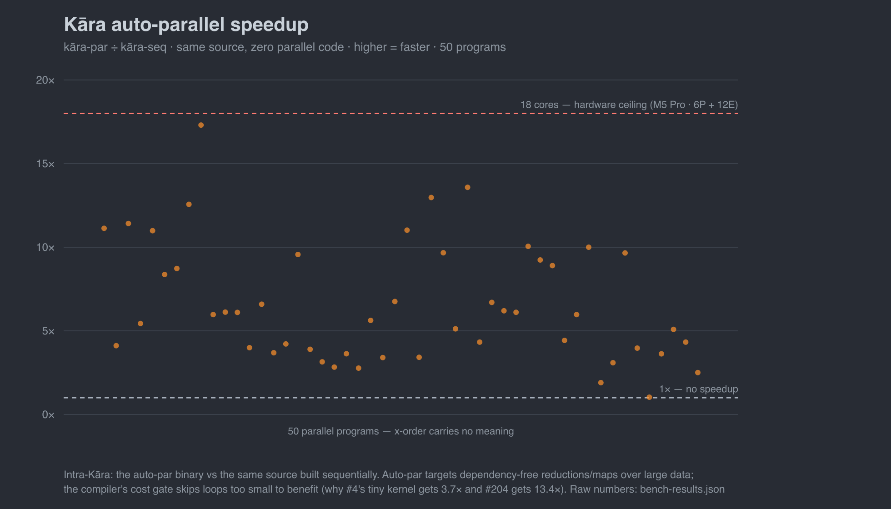
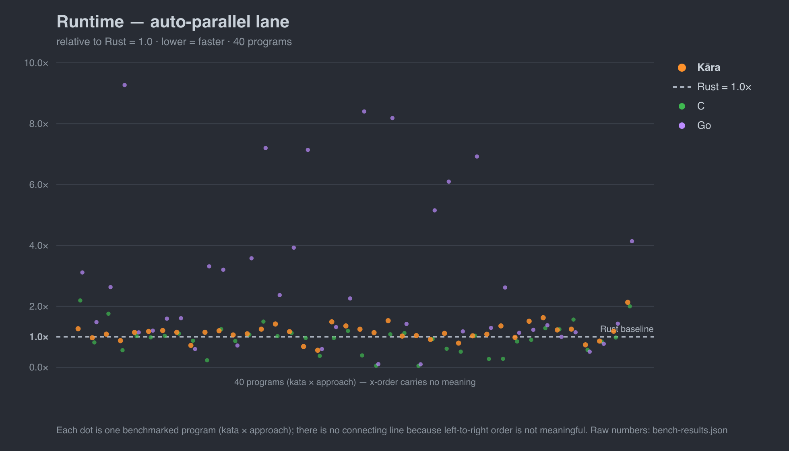

# Benchmarks

The full chart set, redrawn from [`bench-results.json`](bench-results.json) by
[`scripts/bench-graph.py`](scripts/bench-graph.py). Start at the
[README](README.md) for the short version; this page is the complete picture.

**How to read every chart below:** each dot is one benchmarked *program* (a
kata × algorithm-approach). Every value is relative to **Rust = 1.0** (the flat
baseline line); **lower is always better** (faster / smaller / leaner). Kāra is
the orange dots. The dots are deliberately *not* connected — left-to-right order
carries no meaning, so these read as distributions across the suite, not as
trends or time series. (As the corpus grows the dots pile into a density band per
language — that band, and where Kāra's sits relative to the baseline, is the
whole story.) Raw absolute numbers are in the feed.

Languages: **Kāra** (`karac build`), **Rust** (`rustc -O`), **C** (`clang -O3`),
**Go** (`go build`). Python is excluded from these charts — at 10–70× the
compiled languages it would flatten everything; its numbers are in the per-kata
READMEs and the JSON feed.

Python is also **opt-in per run** (`KARA_BENCH_INCLUDE_PY=1`), so which katas
carry a `python` row tracks how each was last benched, not the corpus's
coverage. A kata without one is the expected state, not a gap — Python is the
authoring-parity oracle, not a timed comparison lane.

**One baseline caveat, made explicit:** Kāra checks integer overflow by default;
`rustc -O` **silently wraps** — defined behavior (not UB), but a wrong value where
Kāra would trap. So the gray **Rust (default)** baseline is doing strictly less work
than Kāra on a workload that exercises overflowing arithmetic. The runtime chart therefore overlays a goldenrod **Rust (checked)** ring
— `rustc -O -C overflow-checks=on`, the safety-matched build — on the katas where
the two diverge. That is the apples-to-apples number. Across the corpus the overflow
tax is the bulk of every apparent "Kāra is slower" gap: the worst offenders (#171
1.66×, #9 1.46×, #8 1.41× vs `rust -O`) collapse to **0.99× / 1.08× / 1.15×** once
both languages check, and Kāra's own checked-arithmetic codegen is at *exact* parity
with Rust's in isolation. Kāra even emits **fewer** instructions than safety-matched
Rust on 16 of the corpus's collection/pointer kernels (linked lists, trees, maps,
backtracking — `karac`'s ownership/RC codegen). What survives equal-safety is a
handful of string-shaped kernels (~1.2×) and the low-cardinality sort in #1665 —
both tracked.

**Three-way decomposition of the overflow tax, measured on
[#228](leetcode/201-300/228-summary-ranges/) (2026-07-30, x86 container).** The
caveat above is easy to read as special pleading, so here it is isolated against
*both* reference toolchains on one kernel — a linear range scan with a
loop-carried `start` and a data-dependent break, i.e. the shape where the tax is
worst. All four binaries print the same sink (`333678318888000`):

| build | mean |
|---|---|
| `clang -O3 -march=x86-64-v3`, unchecked | 245.0 ms |
| `clang -O3 -march=x86-64-v3` + `__builtin_add_overflow` on every add | **1124 ms** |
| **`karac build`** | **1107 ms** |
| `rustc -O` (wraps) | 268.8 ms |
| `rustc -O -C overflow-checks=on` | 1293 ms |

Both reference compilers pay **4.6–4.8×** for the same guarantee Kāra gives by
default, and Kāra's checked lowering is *faster than either* — marginally ahead
of clang's own `__builtin_add_overflow` codegen and 14% ahead of safety-matched
Rust. So the 4.19× that this kata shows against `rust -O`, and the 4.73× against
`clang -O3`, measure the semantics, not `karac`. Reducing that cost is a
**check-elision** problem (prove the add cannot overflow, as the bounds-check
elision tiers do for indices) — not a lowering problem; there is no evidence of
headroom in how the checks are emitted.

Practical consequence for anyone ranking this corpus: **ranking by `kara/c_v3`
or `kara/rust` does not surface Kāra weaknesses on arithmetic-heavy kernels — it
surfaces the overflow tax.** A 2026-07-30 pass over the x86 feed ranked the
corpus by `kara/rust` and produced nine katas above 2×; re-ranked against
`rust_ovf`, six of the seven sequential ones sat at **0.87×–1.01×** (#228 0.87,
#169 0.91, #62 0.96, #11/#163/#188 ~1.01) and only #1665 survived, at 1.99×,
exactly as this section already said. Use the `rust_ovf` column.

**Retracted, and what actually happened (2026-07-28).** An earlier revision of
this file held six katas (#128, #133, #141, #160, #242, #290) out of the feed,
attributing their multi-threaded `seq` lanes to nondeterministic runtime
auto-par in `karac 3e9a12ed`. **That attribution was wrong.** All 244 katas are
back in the feed; nothing about the compiler was at fault.

The cause was in this repo's own harness. Both compile-cost lanes rebuilt the
kāra binary to time a cold `karac build` — *without* `KARAC_AUTO_PAR=0` — and
then `mv`'d the result over `target/<stem>_kara`, the exact artifact the seq
runtime lane, `size_put` and `mem_put` read. Two consequences:

- `size_put` / `mem_put` run after `ce_end`, so on **81 of 240** katas (every
  one where the seq and default builds differ) binary size and peak RSS were
  measured on the auto-par binary while runtime was measured on the seq binary
  — mixed provenance inside a single `results.json`.
- The *next* run of the same `bench.sh` found a "fresh" auto-par binary, so
  `build_kara`'s mtime guard skipped the rebuild and the runtime lane silently
  timed a **parallel** binary in a lane labelled `seq`.

That second effect is what the six were. It only bites on a **re-bench**, which
is why the x86 container — which benches each kata once — always read 99.8% CPU
and appeared to exonerate the compiler. The corrections are large:

| kata | published (poisoned) | corrected | inflation |
|---|---|---|---|
| #242 | 9.51 ms @ 1178% | 96.49 ms @ 99.4% | **10.1×** |
| #133 | 25.09 ms @ 1306% | 182.02 ms @ 98.9% | **7.3×** |
| #128 | 9.39 ms @ 1068% | 67.43 ms @ 99.2% | **7.2×** |
| #160 | 23.87 ms @ 1042% | 156.59 ms @ 99.6% | **6.6×** |
| #290 | 40.45 ms @ 1008% | 152.77 ms @ 99.5% | 3.8× |
| #141 | 156.27 ms @ 674% | 205.45 ms @ 99.6% | 1.3× |

#133's poisoned figure is dated **2026-06-15** — this defect has been inflating
published Kāra seq numbers, in Kāra's own favour, for at least six weeks. Fixed
by retargeting both compile-cost lanes to a throwaway `<stem>_kara.ce` path
(202 `bench.sh` + `scripts/new-bench.sh`); the measured binary is never touched.
Corpus-wide check after the fix: **0** katas show a kāra `seq` lane above 150%
CPU.

**Provenance of this feed — mixed by policy, not by backlog.** 198 of 244 katas
are measured on `karac 7db7009e` (121 on 2026-07-28, 77 on 2026-07-27); the
remaining 46 sit on older June/July builds.

This is deliberate. `karac` is under active development, so a corpus that only
counted as valid when every kata sat on one compiler build would be re-swept
continuously and still be stale by the time it finished. **Katas are re-benched
when there is a reason** — a harness fix that invalidated their numbers, a new
lane, a claim that needs checking — not on a schedule. The cost is that the
corpus-level median averages across compiler generations and is softer than a
single number implies; that is the caveat to attach when quoting it, and it is
cheaper than the treadmill.

What this does **not** mean is that older rows may be *wrong*. The one defect
this year that made stale rows actively false — the compile-cost lane clobbering
the binary the seq lane timed — was verified cleared corpus-wide (0 of 244 katas
show a kāra `seq` lane above 150% CPU), so "older" here means measured on an
earlier compiler, not measured incorrectly. Rows from 2026-07-28 onward also
carry `env.karac_build`, a fingerprint of the compiler binary, so which build
produced a row is answerable from the JSON; older rows are datable only by
`measured_at` and gain the fingerprint whenever they are next re-run.

Note that `karac --version` reads `karac 0.1.0` on **every build ever made**,
which is why a feed spanning three generations looked uniform and this had to be
reconstructed from measurement dates. Runs from 2026-07-28 onward carry
`env.karac_build` — a content hash + mtime of the compiler binary — so the
question "which karac produced this row" is answerable from the JSON alone.

**Equal-safety coverage — 249 of 251 program-rows (2026-07-28).** Auditing this
turned up that the overflow-checked Rust twin had been encoded **four** different
ways as the harness evolved, and nothing downstream knew about the last two:

| encoding | katas |
|---|---|
| `lang="rust_ovf"` | 128 |
| `lang="rust"`, `approach="<stem>_ovf"` | 43 |
| `lang="rust"`, `approach="<stem>_rschk"` | 22 |
| `lang="rust"`, `approach="<stem>_overflow_checks"` | 2 |

Reading the raw `lang` labels a checked-Rust number as plain `rustc -O` — the
precise misattribution this lane exists to prevent — so every consumer now
normalises all four. The count was revised upward three times while this was
being sorted out, each time because a spelling had been assumed rather than
enumerated; the figures above come from scanning the `bench.sh` files for
`overflow-checks=on` and reading which row each twin is registered as. New katas
should use `ovf_rt_cmds` (`scripts/bench-lib.sh`), which registers under
`lang="rust_ovf"` and needs no suffix convention at all.

52 katas genuinely had no twin and were comparing Kāra's default-checked
arithmetic against wrapping `rustc -O` and nothing else; all have since been
given one and re-measured. **Two program-rows remain without one, both by
construction:** #28 `kmp_unchecked` and #57 `insert_interval_cap` are
*Kāra-only* variants written to isolate the cost of the checks themselves —
there is no Rust mirror to build, so there is nothing to match safety with.

**A known-flaky kata — recharacterised 2026-07-28, filed as `B-2026-07-28-13`.**
#133's hand-written `par {}` binary — an 18-arm block whose every arm *reads*
the same shared graph — dies silently, with empty stderr, in **~0.8% of runs**
(4 in 500 on `karac 7db7009e`). An earlier revision of this file called it
"SIGTRAP at 1.7%" on a 60-run sample; both numbers were off, and more
importantly the failure is not only a trap. The observed exit codes are **133
(SIGTRAP) ×3 and 139 (SIGSEGV) ×1** — the segfault means memory unsafety, not a
trap firing on a detected condition. Output is never wrong when the process does
exit 0 (0 bad sinks in 500 runs), so it is crash-or-correct. A worker-count
differential points at a data race on the shared read set rather than a
scheduler bug: **0/200 at 1 worker, 0/200 at 2, 2/200 at 18**. Its par-lane
numbers are provisional. Whether this is a regression is still **not**
established — at ~0.8% a clean 60-run bench is close to a coin flip, so June's
success is no evidence of a start date, and no bisect has been done.

**What the overflow tax actually is, measured (2026-07-27).** The phrase "overflow
tax" undersells the mechanism on array kernels: checked arithmetic does not add a
few instructions per iteration, it **forfeits vectorization entirely**. Disassembled
on the M5 for [#122](leetcode/101-200/122-best-time-to-buy-and-sell-stock-ii/)
(`profit += max(0, p[i]-p[i-1])` over 2M `i64`), inside the *same* Rust symbol:

| build | vector instrs | overflow-check branches | mean |
|---|---|---|---|
| `rustc -O` (wraps) | **240** | 0 | 6.4 ms |
| `rustc -O -C overflow-checks=on` | **0** | 29 | 15.6 ms |
| `karac` (checks by default) | **0** | per-op `b.vs`/`b.vc` | 14.4 ms |

So Kāra's apparent 2.3× deficit against `rustc -O` on this kata is a vectorized-vs-
scalar comparison wearing a costume, and against the safety-matched build Kāra is
**ahead** (14.4 vs 15.6 ms). Rust forfeits exactly the same vectorization when asked
for the same guarantee — this is the price of the contract, not a `karac` codegen
gap. It also sets the ceiling on what fixing checked-arithmetic codegen could ever
recover on such kernels: ~2.4×, and only by teaching the vectorizer to keep the
checks, which neither compiler does today.

**Correction (2026-07-26):** the string-shaped residual was long attributed to
1-byte `push_str` loops. Measured on
[#127](leetcode/101-200/127-word-ladder/), that attribution is **wrong**: a
104k-iteration char-by-char `String` build is a dead tie with Rust (5.5 ms vs
5.4 ms), while building and probing a `Map[String, _]` of 3,125 keys is
**2.45×** behind an equal-hash Rust `HashMap` (37.9 ms vs 15.5 ms). Filed as
`B-2026-07-26-2`.

**Correction to the correction (same day, after acting on it).** The sentence
above originally continued "— and that one ratio accounts for the whole kata
deficit." That was an *inference from a microbenchmark*, and it did not
survive contact with a fix. Two measured improvements to the String-keyed map
landed in `karac` (a direct rehash on growth, and a monomorphised String-key
lookup probe; ~1.13× each on the path each targets) and **#127 did not move**
— 1.82× against the equal-hash Rust lane afterwards versus 1.62× before, i.e.
unchanged within this container's cross-session variance. The reason is
visible once looked for: ~20 of every 25 candidate lookups in #127 **miss**,
and a miss stops at the first empty bucket — one byte load, no comparison — so
the probe was never that kata's hot path.

The map really is ~2× behind and that is worth fixing on its own merits. But
**where a corpus-level deficit lives has to be established by intervention,
not by an isolated microbenchmark** — on this bug, isolated benchmarks
predicted the wrong culprit twice running.

**A second baseline caveat — CPU baseline, found 2026-07-26, now measured across
all 245 katas.** `karac build` targets **`x86-64-v3`** (Haswell+, AVX2)
by default on x86-64 — a deliberate deploy-baseline commitment in the language
design (`cpu-baseline = "v3"`), not an accident. `clang -O3` and `rustc -O` at
*their* defaults target **`x86-64` v1** (SSE2). So on x86 hosts every lane in
this corpus compares an AVX2 Kāra binary against baseline-ISA C and Rust.

How much that is worth depends entirely on whether the kernel vectorizes:

- On the **vast majority** of the corpus — pointer chasing, maps, trees,
  backtracking, string building, branchy DP — it is worth nothing measurable,
  because none of it vectorizes at any baseline.
- On a **vectorizable array kernel** it is worth a lot. Measured on
  [#260](leetcode/201-300/260-single-number-iii/) (a two-pass XOR over 200k
  `i64`): Kāra appears **1.44× ahead of C** at the two languages' defaults, and
  the entire lead evaporates — a four-way tie inside 1.06× — once C and Rust are
  rebuilt with `-march=x86-64-v3` / `-C target-cpu=x86-64-v3`. Forcing Kāra down
  to `--target-cpu=x86-64` costs it the same 1.4×.

Every previously published number in this corpus was measured before this was
noticed. Nothing is being withdrawn — the bias is one-directional and only bites
where SIMD applies, which is a small minority of these kernels, and it did not
manufacture Kāra's *losses* (e.g. [#137](leetcode/101-200/137-single-number-ii/)
loses 7.9× to C **with** AVX2 in hand). But **any Kāra win on an array kernel
should be re-checked at equal baseline before it is quoted**, and new
array-shaped katas carry an explicit equal-baseline lane, the same way the
equal-safety `rust_ovf` lane works above. The apples-to-apples comparison
matches *both* axes: equal safety **and** equal ISA baseline.

**Corpus-wide correction landed (2026-07-27), and measured 2026-07-29.** The
equal-baseline lane is no longer per-kata and opt-in. `scripts/bench-lib.sh`
carries `isa_build_c` / `isa_build_rust` / `isa_rt_cmds`, wired into **every**
`bench.sh` — 244 under `leetcode/` plus `bespoke/utf8-codepoints`, which the
original migration missed because the tooling only walked `leetcode/`. An x86
sweep has since run the lane on all 245, so the numbers below are measured
rather than projected. They add two twins:

- **`c_v3`** — `clang -O3 -march=x86-64-v3`
- **`rust_v3`** — `rustc -O -C overflow-checks=on -C target-cpu=x86-64-v3`, matched
  on *both* axes at once, and therefore the single honest apples-to-apples number

Each twin's output is verified against the Kāra binary's sink before it is timed,
so a twin that traps or diverges is dropped with a warning rather than measured.

**What the measured lane actually shows (245 katas, 250 comparable groups, x86
container).** The effect is real but far narrower than the #260 discovery
suggested, and the honest summary is *concentrated*, not *corpus-wide*:

| | |
|---|---|
| C `-O3` → `-march=x86-64-v3`, median | **1.005×** — nothing |
| …mean / p90 / max | 1.072× / 1.14× / 12.04× |
| groups gaining >15% from v3 | **21 / 250 (8%)** |
| groups *losing* >15% to v3 | **14 / 250** |
| Rust `-O` → `rust_v3` (safety+ISA), median | 0.980× |
| Rust overflow-checks alone, median | 1.038× |

Three things follow, and the first two cut against the original framing:

- **On the median kata the ISA baseline is worth nothing.** Reading the earlier
  #260 result as a corpus-wide tax on every x86 comparison was wrong; it is a
  vectorizable-array-kernel effect that most of this corpus never triggers.
- **v3 is not uniformly a speedup for C.** It is >15% *slower* on 14 groups —
  more groups than it helps by that margin. Verified in isolation on
  [#64](leetcode/1-100/64-minimum-path-sum/): `1.38 ± 0.08×` slower at v3, ~6σ,
  on a serial `dp[c] = cost + imin(dp[c], dp[c-1])` recurrence that **neither**
  build vectorizes. The v3 codegen is 572 asm lines vs 325 and issues 5 `cmov`
  against 1 — clang speculates both `imin` arms into conditional moves, which
  lengthens a dependency chain it cannot hide. So "matched ISA" is not a synonym
  for "stronger C," and on such kernels the default `c -O3` lane is the *harder*
  comparison for Kāra, not the easier one.
- **Of Kāra's leads over C, 7 do not survive equal baseline** (18 nominal flips,
  7 past the noise floor below): #122, #137, #45, #260, #153 (both approaches),
  #268. Kāra leads `c_v3` in 46 of 250 groups.

**Read nothing under ~1.15× from container-x86 data.** Median relative σ on that
shared 4-core host is 5.7% and p90 is 15.7%, so sub-1.15× gaps are not
distinguishable from noise — a first pass at the bullet above counted 18 flips
before gating, and a separately flagged "v3 pessimizes #42 by 1.31×" evaporated
to `1.03 ± 0.13×` when re-run on an idle machine. Absolute times are also **not**
comparable across katas measured hours apart: re-benching five katas ~18h later
found every lane 6–22% slower in every language (median 0.86×, uniform across C,
Go, Rust, and Kāra alike), which is host drift, not codegen. Only within-file
ratios are safe, which is exactly what the single interleaved `hyperfine` call
per `rt` block exists to guarantee.
Charts render them as optional overlays; the out-of-the-box `rust` / `c` lanes
stay in the feed, because "what a user gets by default" is a real and separate
question from "whose codegen is better." Both are published; neither is allowed
to stand in for the other.

**These lanes are x86-only, and that is a measured decision, not an assumption.**
On aarch64 the helpers are deliberate no-ops. Checked on the M5 (2026-07-27):
`clang` defaults to `-mcpu=apple-m1` and `rustc` likewise, and rebuilding at
`-mcpu=generic` produces different binaries but statistically identical times
(6.3–6.8 ms, σ 0.7–0.9 on #122). Forcing the lane on via `BENCH_ISA_FORCE=1
ISA_LEVEL=native` confirms it from the other side: `c_v3` 5.93 ms vs `c` 5.93 ms,
`rust_v3` 16.39 ms vs `rust_ovf` 16.36 ms. There is no ARM baseline gap to
correct, so the Apple-Silicon numbers in this corpus never carried this caveat.

## Runtime — sequential lane

Single-threaded, same algorithm everywhere. This is the load-bearing
per-core compiler-quality comparison.

Kāra's cloud tracks C's closely and sits at or below the **Rust (checked)** rings
on most programs — i.e. at parity with *safety-matched* Rust, ahead on the
collection/pointer kernels, with the only daylight to the gray `rust -O` baseline
being the overflow checks Rust opts out of by default (see the baseline caveat
above). The residual equal-safety gaps are string-building kernels and #1665's sort.
Go trails on most single-threaded work.

Corpus-level, sequential lane, on the 249 program-rows that carry a
safety-matched Rust twin (2026-07-28, M5 Pro):

| comparison | n | median | p10 | p90 | Kāra faster |
|---|---|---|---|---|---|
| vs Rust `-O -C overflow-checks=on` | 249 | **1.00×** | 0.74× | 1.20× | 133/249 (53%) |
| vs C `clang -O3` | 249 | 1.18× | — | — | 43/249 (17%) |

Read the median as "a coin flip against safety-matched Rust, and consistently
behind C" — not as a headline. The p10/p90 spread is the real content: the
distribution is wide in both directions, the tails are what the per-kata pages
explain, and the figure still averages across compiler generations (see
Provenance).

## Binary size — sequential lane

Stripped native binary, on disk. Log scale, because Go is ~70× the others.

Kāra emits C-sized binaries (~33 KiB) for most programs and rises to its
~285 KiB compute floor when it links the larger runtime surface (hash maps,
strings). Rust sits ~14× above C; Go ~70× above, carrying its runtime + GC in
every binary.

## Runtime peak memory — sequential lane

Peak RSS during execution.

Kāra, C, and Rust cluster at parity (~1.0×) — Kāra runs leak-free at native
footprint. Go's GC heap pushes it to 2–8× depending on allocation pressure.

## Compile time — cold

Wall-clock for a full cold compile of one file (artifact deleted first). Go is
omitted: `go build` bundles module resolution + multi-package compile + link,
which isn't comparable to a single-file compiler invocation.

Kāra's compiler is faster than `rustc -O` on every program here (~0.55–0.8×),
sitting between clang (the LLVM single-file floor) and rustc.

## Compile peak memory — cold

Peak RSS of the compiler process. Go omitted for the same reason as above.

Kāra compiles in ~0.3× of rustc's peak memory — again between clang and rustc,
with no algorithmic blowup.

## Auto-parallel speedup (Kāra)

Kāra's compiler automatically parallelizes dependency-free reductions and maps —
no `rayon`, no goroutines, no thread plumbing, and no data-race risk, because the
transform belongs to the compiler, not to you. This chart is *intra-Kāra*: the
auto-par binary against the **exact same source** compiled sequentially.

This is the one place Kāra does something mainstream languages don't hand you for
free — which also makes it the easiest chart to over-read, so read it carefully:

- **It applies to data-parallel reductions/maps over large datasets** — `Σ f(xᵢ)`
  over millions of independent inputs, the shape behind analytics rollups,
  numeric kernels, simulation, per-record/per-pixel work. It does **nothing** for
  I/O-bound, tiny, or sequentially-dependent loops, and the compiler's **cost gate
  declines** to parallelize loops too small to pay off. That's exactly why #4's
  ~hundred-nanosecond kernel earns only 3.7× while #204's heavier kernel reaches
  13.4×, against an 18-core ceiling.
- **The speedup is workload- and core-bound physics, not a universal multiplier**
  on your program. The honest claim is *ergonomic, safe, automatic parallelization
  where it applies* — these numbers are evidence it scales, not a promise about
  arbitrary code.
- **This is a real distribution now (26 programs), not a teaser.** Every kata
  whose `karac build` engages auto-par contributes a point; the spread from the
  cost-gate floor up to ~13× against the 18-core ceiling is the spectrum, not a
  single illustrative number.

### Cross-language parallel lane

The *other* parallel comparison — Kāra auto-par (zero parallel source) vs Rust
`rayon` vs Go goroutines vs a C-pthreads metal floor on the same workload — is
the headline chart in the **[README](README.md#parallel-lane--auto-par-vs-hand-tuned)**:

**31 programs** now ship the full parallel comparator set. Across them Kāra's
auto-par runs at a median **1.13× of hand-tuned `rayon`** (typically within
~10–15%, with zero parallel source), is **faster than `rayon` outright on seven**
(best #22 0.47×), wins against Go's goroutines on **24 of 31** (goroutine dispatch
overhead swamps fine-grained reductions), and **edges or matches the raw-pthreads
C floor on nine** of the allocation-heavy ones — for none of the engineering cost.
A handful of string-/allocation-churn kernels trail both C and Go (worst #71
simplify, ~8.8× of C); the chart shows them. Katas whose per-call work is too
small for rayon/goroutine dispatch to win (parallelizing them by hand would
*lose* to sequential) contribute only the intra-language auto-par speedup above
and stay seq-only here. More points land automatically as parallel katas are added.

## Caveats

The same honesty notes from the [README](README.md#what-these-numbers-are--and-arent)
apply: these are single-file algorithm kernels, not applications; wall-times are
noise-limited (shared M5 Pro), while size and memory are stable. Read the shape,
not the last digit, and consult [`bench-results.json`](bench-results.json) for
the underlying numbers.

### Code placement (arm64)

On Apple silicon a program's speed depends partly on **where its machine code
sits** — on the hot loop's address mod 64, the instruction-fetch granularity.
Rebuild after any change that shifts emitted code size ahead of `main`, and the
same source, compiler and input can run measurably faster or slower. So a single
recorded figure is one draw from a distribution, and a reader who rebuilds a
kata locally may not land on ours.

This is **not** a Kāra defect — it is a property of the machine, and C and Rust
binaries are subject to it too. It also does **not** move the corpus-level
figures, which are medians over hundreds of katas and average the draw out. It
matters for a *single* kata's number, which is exactly what a reader reproduces.

The corpus has been measured for it rather than assumed
([`scripts/placement-spread.py`](scripts/placement-spread.py), full results in
[`placement-spread.json`](placement-spread.json)). Each kata is built at four
code placements — moving `main` by a chosen number of bytes while leaving every
instruction identical — and timed interleaved against a **same-binary control**,
so each kata's own measurement noise is subtracted rather than assumed away.
Across 258 kata/approach pairs:

| placement range (net of control) | pairs |
|---|---|
| under 1% | 144 |
| 1–5% | 86 |
| 5–10% | 18 |
| over 10% | 10 |

Median 0.8%, worst 47%. The wide tail is not random: it is loops with **large,
branchy bodies** — tree and graph traversals, and one hash-probe kernel — where
the body straddles fetch blocks and the branch predictor, which indexes on
address, re-aliases when the code moves. Tight arithmetic loops are flat
(kata:11 measures 0.3%).

**What to do with a narrow margin.** Thirteen katas have a placement range at
least 3× wider than the margin they quote against their nearest comparator; each
now carries a caveat at the top of its Benchmarks section. The general rule: **a
gap smaller than the kata's placement range is a tie, not a result.** The widest
cases are #145 (47% range against a 0.1% margin), #210 (35% / 1.5%) and #144
(32% / 2.4%).

The mechanism, the levers that measure it (`KARAC_TEXT_PAD`), and why forcing
code alignment is not a fix are in the compiler's bug ledger under the placement
entries.
