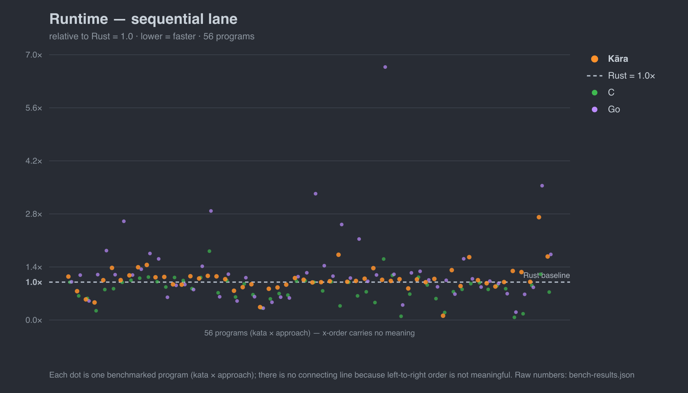
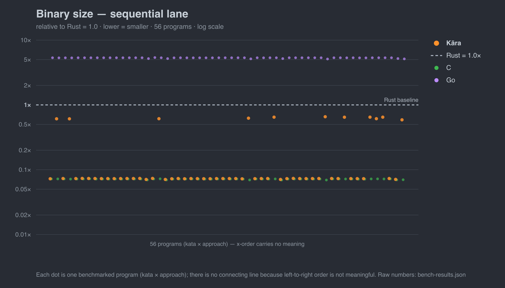
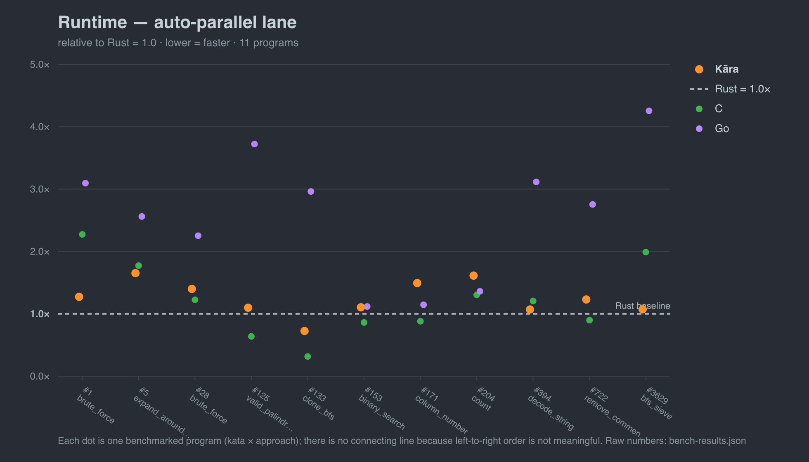

# Kāra Katas

Classic algorithm problems (LeetCode-style) implemented in **[Kāra](https://github.com/karalang/kara)** and mirrored, algorithm-for-algorithm, in **C, Rust, Go, and Python**. The corpus does double duty: it exercises the Kāra compiler against real code, and it benchmarks Kāra's compiled output against mainstream languages on identical workloads.

Kāra is a young systems language. The point of the charts below is narrow and honest: on these problems, Kāra's compiled output already lands *in the pack* with C, Rust, and Go — not in some "early experiment" tier off to the side.

## Runtime — sequential lane

Single-threaded, same algorithm in every language, native binaries (`karac build` / `rustc -O` / `clang -O3` / `go build`). Each dot is one benchmarked program; lower is faster; everything is relative to Rust = 1.0. The dots aren't connected by a line because left-to-right order is meaningless — read it as a distribution, not a trend.



Kāra's orange dots sit clustered around the Rust baseline — ahead on the allocation- and string-heavy workloads, behind on a couple, tracking C's green cloud closely. It loses on some programs, and the chart shows that plainly.

## Binary size



Kāra emits **C-sized binaries** (~33 KiB) for most programs, rising to its ~285 KiB compute floor when a program pulls in the larger runtime surface (hash maps, strings). Either way it sits far below Rust, and roughly **70× smaller than Go**, which carries its runtime + GC in every binary.

## Parallel lane — auto-par vs hand-tuned

This is the one thing Kāra does that the others don't hand you for free. The katas below have a data-parallel reduction over their workload; Kāra's compiler parallelizes it automatically from the **same single-threaded source**, while the Rust/Go/C mirrors had to be *rewritten* by hand — Rust pulls in the `rayon` crate and an `.into_par_iter()`, Go hand-rolls goroutine chunking + a `WaitGroup` + a merge, C raw `pthread_create`/`join`. Each dot is one program; lower is faster; relative to Rust = 1.0.



The honest result: across the five katas with a full parallel comparator set, Kāra's auto-par — **with zero parallel code** — lands in the *same range* as hand-tuned `rayon`, ahead on two (#394 1.17×, #125 1.06×) and behind on three (by at most 1.45×), and well ahead of Go's goroutines on fine-grained work (4× on #125). It even **edges the raw-pthreads C metal floor on two katas** (#1 1.66×, #394 1.15×) — a pooled lightweight scheduler beating hand-rolled OS threads on allocation-heavy work. It is **not** uniformly faster than `rayon`, and the chart shows that. The point isn't "beats rayon" — it's **competitive throughput for none of the cost**: no crate, no API rewrite, no `unsafe`/`Send`/`Sync` reasoning, and no data-race, goroutine-leak, or partial-merge bug class to chase. The compiler's cost gate also *declines* to parallelize loops too small to pay off, so this lane only includes katas where the reduction is heavy enough to matter.

## The rest of the picture

Four more charts — compile time, compile memory, runtime memory, and Kāra's intra-language auto-par speedup (same source, parallel ÷ sequential) — plus the methodology live in **[BENCHMARKS.md](BENCHMARKS.md)**.

## What these numbers are — and aren't

- **Same algorithm, same workload** per program, across all languages. The comparison is of *compiled output and runtime quality*, not of who can write the cleverest solution.
- These are **single-file algorithm kernels**, not whole applications. They measure codegen and runtime behavior on tight loops; they do **not** claim to predict real-world application performance.
- **Wall-time numbers are noise-limited** (measured on a shared M5 Pro under load) — treat them as approximate and read the *shape*, not the third digit. The deterministic metrics (binary size, peak memory) are stable run-to-run.
- Raw data for every chart lives in **[`bench-results.json`](bench-results.json)**; the measurement protocol is **[BENCH.md](BENCH.md)**.

## Reproducing

Each kata ships a `bench/bench.sh` that builds every language's mirror, checks they all print the same result, then times and measures them:

```bash
brew install hyperfine          # also needs karac, rustc, clang, go
cd leetcode/1-100/1-two-sum/bench && ./bench.sh   # writes bench/results.json

./scripts/consolidate-bench.sh  # merge all per-kata results → bench-results.json
python3 scripts/bench-graph.py  # redraw graphs/*.svg from the consolidated feed
./scripts/render-png.sh         # graphs/*.svg → graphs/*.png (GitHub embeds these)
```
